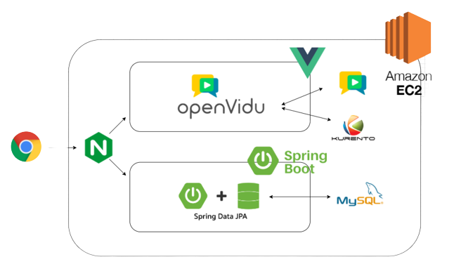

  

      

비대면 헬스클럽 on:FIT

on:FIT은 언제 어디서나 운동을 시작할 수 있습니다. AI트레이너의 자세코칭으로 올바른 자세를 학습하며 함께 운동해봅시다.

​	  

## :muscle: 팀 소개

- 프론트: 백민아, 최승연
- 백엔드: 김중재, 김지수

​		 

## :muscle: 프로젝트 소개

  

<a href="README.assets/와이어프레임.pdf">와이어 프레임</a>	·	<a href="README.assets/ERD.pdf">ERD</a>	·	
      <a href="README.assets/기술명세서.pdf">Frontend 기술명세서</a>    · 	<a href="README.assets/API문서.pdf">API문서</a>

#### 기획의도

시공간을 제약받고 있는 코로나 영향을 언제 어디서나 즐길 수 있는 온핏을 통해 몸과 정신 모두 건강해지는 시간을 제공하고자 합니다.

#### 주요 기능 및 목표

1. AI트레이너의 자세 코칭: webRTC를 활용한 사용자간 실시간 소통 기능 구현하기

2. 온라인 단체 헬스클럽: Teachable Machine을 활용한 인공지능 기술 경험하기

    

#### 주요 기술 스택

1. 사용언어
   - JAVA
     - 버전: Open JDK 1.8.0_192
     
   - JavaScript

      

2. 프레임워크
   - Spring Boot Framework

   - Vue 2

   - Swagger

      

3. Database / Server
   - MySQL 8.0.x

      

4. 라이브러리 및 API
   - 프론트
     - Teachable Machine - pose project
     - Kakao 음성 합성 API
     - Vuetify
     - epic-spinners, vue-apexcharts, vue-functional-calendar

   - 백엔드
     - webRTC기반 Openvidu
     - JPA

   - Google Login API

      

#### 프로젝트 구조

